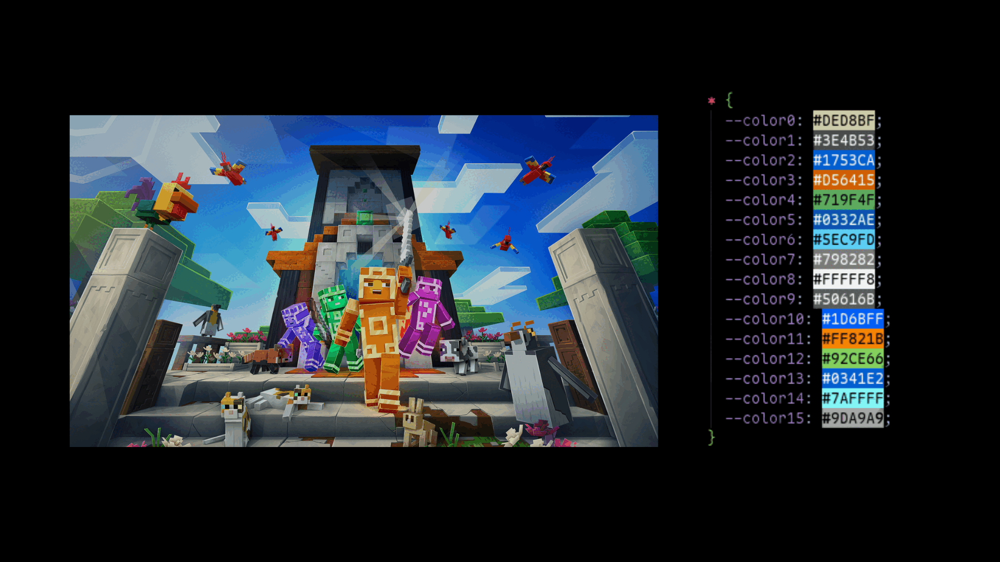

# Huegen 🎨

Fast C++ wallpaper color extractor. Generates 16 colors (8 base + 8 bright) from any image for terminal theming.



## Quick Start

```bash
# Install dependencies
sudo apt install libopencv-dev

# Compile
g++ main.cpp -o huegen -I/usr/include/opencv4 -lopencv_core -lopencv_imgcodecs -lopencv_imgproc


# Extract colors
./huegen wallpaper.jpg > theme.css
```

## Output

```css
* {
  --color0: #B25426;
  --color1: #3683D9;
  ...
  --color15: #25593E;
}
```

## Why Huegen?

- **Fast**: C++ + OpenCV for speed
- **Simple**: Single binary, minimal deps
- **Smart**: K-means clustering with distance filtering

## Integration

```bash
# Alacritty
./extractor img.jpg | sed 's/--color/color_/g' >> ~/.config/alacritty/alacritty.yml

# Any theme system
./extractor img.jpg > colors.css
```

MIT License • PRs welcome

# Huegen
